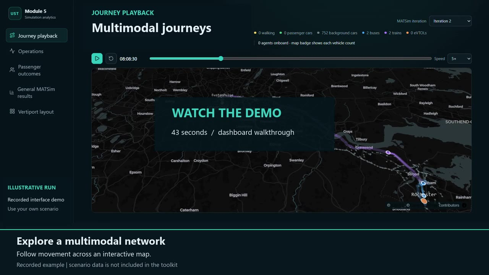
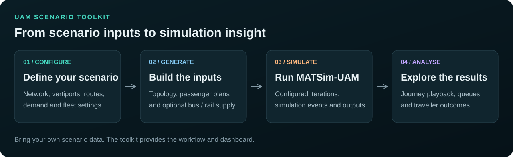
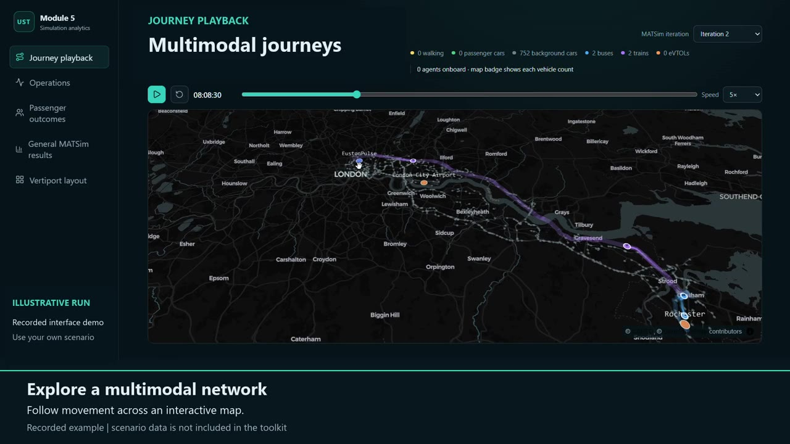
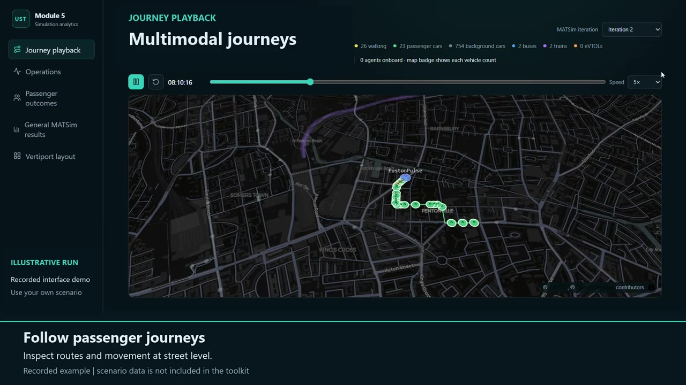
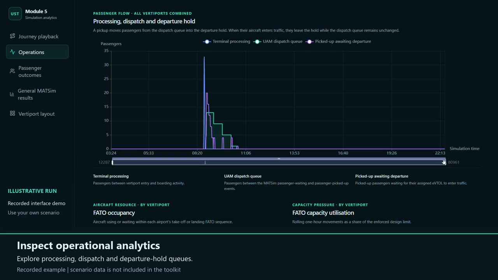

# Toolkit in pictures

UST connects scenario preparation, MATSim-UAM simulation and a local analytics
dashboard. These views show the interface in use.

## Short demo

[Download the 43-second video](https://github.com/Chirag-Srinivas/UST-Toolkit/releases/download/v1.0.2-prepared/UST-Toolkit-demo.mp4) (MP4, 1280 × 720, 30 fps, 2.1 MB).
The demo is silent and uses on-screen captions.

- 0:00–0:05: toolkit overview.
- 0:05–0:32: network exploration and multimodal journey playback.
- 0:32–0:38: operational queue analytics.
- 0:38–0:43: starting your own scenario.

The footage comes from an existing recorded run. It illustrates the interface;
the displayed geography, movements and chart values are not a scenario supplied
with the toolkit or a new validation result. See [validation](VALIDATION.md)
for the checks performed on the released software.

## How the workflow fits together

Provide your own base network and scenario settings. The toolkit generates the
scenario files, runs the configured simulation and extracts the dashboard data.

## Explore a multimodal network

Inspect the network and observe movement across travel modes using playback controls.

## Follow journeys at street level

Zoom into routes and examine movement in more detail.

## Inspect operational queues

Explore how passenger queues change over simulation time.

## About these visuals

The owner supplied the source recording. The public-facing edit omits the thesis
introduction, experimental-design and results slides, institution branding,
original narration, study title and run identifiers. New UST title cards and
toolkit captions replace the presentation framing. Geographic labels and map
attribution remain visible.

The screenshots are frames from the edited video. The workflow diagram is
maintained as an SVG. No original study input files or result datasets accompany
these visuals. Existing release ZIPs remain unchanged; the video and its checksum
are separate release assets, so the MP4 is not tracked in Git history.

[Media checksums and edit record](images/media-provenance.json).
